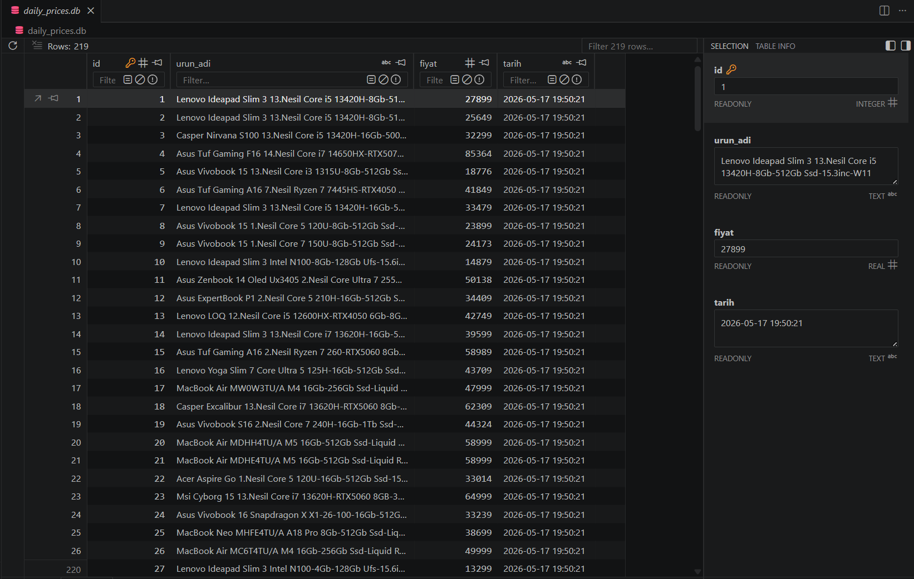
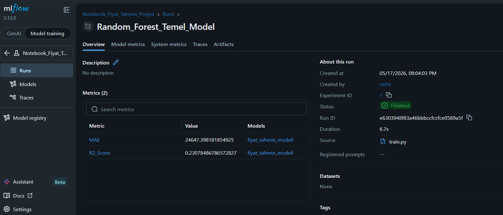
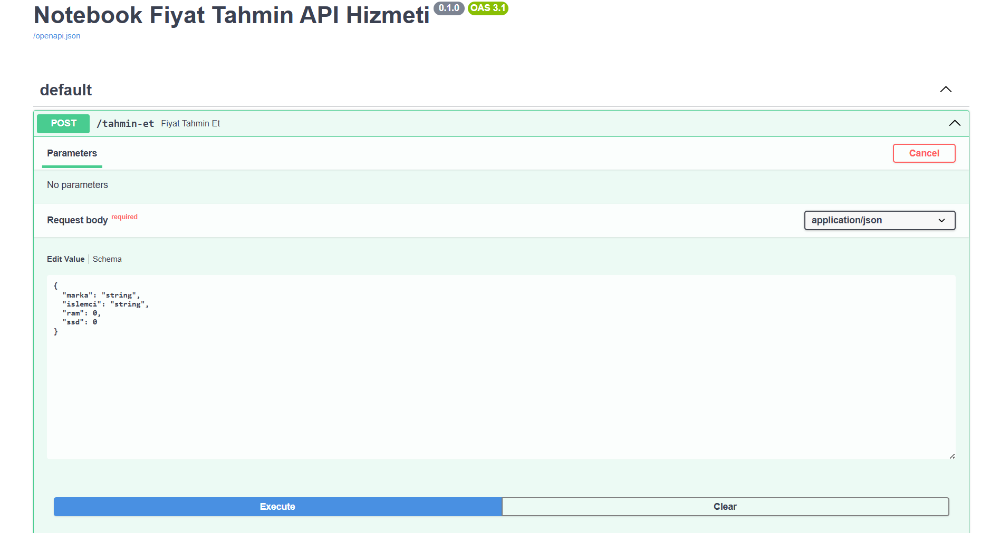
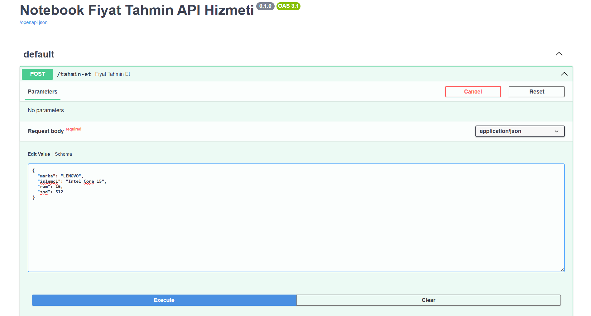
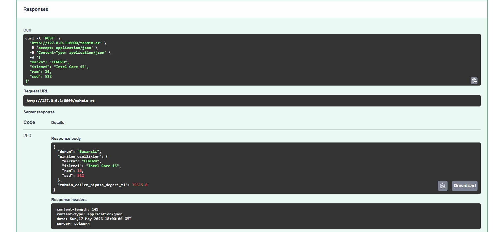

# 💻 End-to-End MLOps: Notebook Price Prediction and Tracking System

This project is an **end-to-end MLOps (Machine Learning Operations)** pipeline that begins with real-time web scraping from a popular e-commerce platform (Vatan Bilgisayar), cleans and stores the data in a relational database, trains a machine learning model to predict prices, and deploys the model as a publicly accessible web service (API).

Unlike traditional "copy-paste pre-existing dataset (CSV)" projects, this system simulates all stages of data engineering, feature engineering, experiment tracking, and deployment within a local architecture.

---

## 🛠️ Technologies Used

- **Data Engineering:** Python, Requests, BeautifulSoup4, SQLite3, RegEx
- **Data Science & AI:** Pandas, Scikit-Learn (Random Forest Regressor)
- **MLOps & Experiment Tracking:** MLflow
- **Model Deployment (Serving):** FastAPI, Uvicorn, Pydantic
- **Environment Independence:** Docker (Dockerfile & Requirements are ready)

---

## ⚙️ Project Architecture and Workflow

1. **Data Ingestion:** The `scraper.py` script automatically crawls all active pages under the notebook category of the target website. It manages dynamic `User-Agent` and `Referer` headers to safely bypass bot protection mechanisms.
2. **Smart Data Control:** To prevent database bloating and duplicate records when executed multiple times within the same day, the system implements an in-memory *Smart Memory (Seen Set)* mechanism along with a unique constraint at the SQLite database level.
3. **Feature Engineering:** Using `RegEx` (Regular Expressions), textual raw product names are parsed dynamically into structured numerical and categorical features that the model can understand: **Brand, Processor Type, RAM Capacity, and SSD Size**.
4. **Experiment Tracking & Logging (MLflow):** Every time the model is trained, the hyperparameters used, data volume, **MAE (Mean Absolute Error)**, and **R2 Score** are versioned and logged directly into `MLflow`.
5. **Live API Serving:** The trained Random Forest model is served behind a `FastAPI` instance. An interactive endpoint is exposed, allowing users to input hardware specifications and receive real-time market value predictions from the AI model.git add 

---

## 👁️ About This Project 

**1. SQLite Relational Database View**
The raw data table collected, cleaned, and prepared for feature engineering by the web scraper:

**2. MLOps Experiment Tracking Panel (MLflow Dashboard)**
The centralized management interface where training history, error metrics (MAE, R2), and model artifacts are tracked:

**3. Live AI API (FastAPI Swagger UI)**
The real-time market value prediction generated by the model within milliseconds based on the submitted hardware specifications:

## 🚀 Installation and Local Execution
Follow the steps below in order to set up and run the project on your local machine.

**Prerequisites**
Ensure that Python 3.10 or a higher version is installed on your system.

1. Clone the Repository and Navigate to the Directory
Bash
git clone [https://github.com/YOUR_USERNAME/YOUR_REPOSITORY_NAME.git](https://github.com/YOUR_USERNAME/YOUR_REPOSITORY_NAME.git)
cd YOUR_REPOSITORY_NAME
2. Install the Required Dependencies
Bash
pip install -r requirements.txt
3. Run the Data Ingestion Pipeline (Generate the Data)
To crawl all active pages on the website and save up-to-date laptop prices into the daily_prices.db file:

Bash
python scraper.py
4. Train the Model and Initialize the MLflow Experiment
To execute feature engineering steps, train the machine learning model, and send metrics to the MLOps dashboard:

Bash
python train.py
5. Launch the MLflow Experiment Tracking UI
To graphically inspect the metrics of the trained model, start the tracking server (configured with a single worker for Windows compatibility):

Bash
mlflow ui --workers 1
Once the server starts running, you can access the dashboard by navigating to http://127.0.0.1:5000 in your web browser.

6. Serve the Machine Learning Model as a Live API
To deploy the prediction mechanism and test it live, spin up the local server:

Bash
uvicorn api:app --reload
After the API starts successfully, visit http://127.0.0.1:8000/docs to interact with the model via Swagger UI by sending arbitrary hardware specs to receive instant price predictions.

## 🐳 Running with Docker (Optional)
The project is fully prepared for Docker containerization to ensure environment independence. If you have Docker Desktop installed on your system, you can build and run the entire application inside an isolated container using just two commands:

Bash
# Build the Docker image
docker build -t notebook-prediction-api .

# Run the container, exposing it on port 8000
docker run -d -p 8000:8000 notebook-prediction-api
Once the container is up and running, you can access the API on your local machine via http://127.0.0.1:8000/docs.